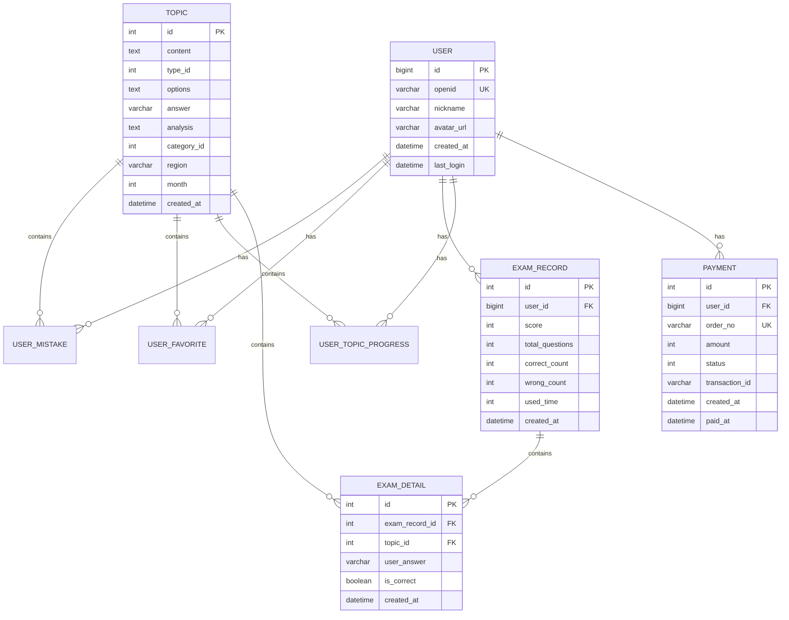

# 设计文档

## 概述

本设计文档针对教师编时政刷题小程序的12个待完善功能模块提供详细的技术设计方案。系统采用微信小程序前端 + Flask后端 + MySQL数据库的架构，旨在为用户提供完整、流畅的刷题学习体验。

## 架构

### 系统架构图

```
┌─────────────────────────────────────────────────────────────┐
│                      微信小程序前端                           │
│  ┌──────────┬──────────┬──────────┬──────────┬──────────┐  │
│  │  首页    │ 题目列表 │ 考试模式 │ 错题本   │ 个人中心 │  │
│  └──────────┴──────────┴──────────┴──────────┴──────────┘  │
└─────────────────────────────────────────────────────────────┘
                            │
                            │ HTTPS/REST API
                            ▼
┌─────────────────────────────────────────────────────────────┐
│                      Flask 后端服务                          │
│  ┌──────────────────────────────────────────────────────┐  │
│  │  认证中间件 (JWT)                                     │  │
│  └──────────────────────────────────────────────────────┘  │
│  ┌──────────┬──────────┬──────────┬──────────┬──────────┐  │
│  │ 用户管理 │ 题目管理 │ 考试管理 │ 进度管理 │ 支付管理 │  │
│  └──────────┴──────────┴──────────┴──────────┴──────────┘  │
└─────────────────────────────────────────────────────────────┘
                            │
                            │ SQLAlchemy ORM
                            ▼
┌─────────────────────────────────────────────────────────────┐
│                      MySQL 数据库                            │
│  ┌──────────┬──────────┬──────────┬──────────┬──────────┐  │
│  │  用户表  │  题目表  │ 错题表   │ 收藏表   │ 考试表   │  │
│  └──────────┴──────────┴──────────┴──────────┴──────────┘  │
└─────────────────────────────────────────────────────────────┘
```

### 技术栈

- **前端**: 微信小程序 (WXML, WXSS, JavaScript)
- **后端**: Flask 3.1.2, SQLAlchemy 2.0.43, PyMySQL 1.1.2
- **数据库**: MySQL 8.0+
- **认证**: JWT (PyJWT 2.9.0)
- **支付**: 微信支付API
- **部署**: Docker, Docker Compose


## 组件和接口

### 1. 随机练习功能

#### 前端组件

**页面文件结构**:
```
pages/random-practice/
├── random-practice.js      # 页面逻辑
├── random-practice.json    # 页面配置
├── random-practice.wxml    # 页面结构
└── random-practice.wxss    # 页面样式
```

**页面状态管理**:
```javascript
data: {
  questions: [],           // 题目列表
  currentIndex: 0,         // 当前题目索引
  startMonth: 1,          // 起始月份
  endMonth: 12,           // 结束月份
  userAnswers: {},        // 用户答案
  showResult: false,      // 是否显示结果
  correctCount: 0,        // 正确数量
  wrongCount: 0          // 错误数量
}
```

#### 后端接口

**API端点**: `GET /api/topics/random`

**请求参数**:
```json
{
  "startMonth": 1,
  "endMonth": 12,
  "count": 20,
  "userId": 123456
}
```

**响应格式**:
```json
{
  "code": 0,
  "message": "获取成功",
  "data": [
    {
      "id": 1,
      "content": "题目内容",
      "type": 1,
      "options": [{"key": "A", "content": "选项A"}],
      "answer": "A",
      "analysis": "解析内容",
      "month": 5
    }
  ]
}
```

### 2. 考试模式优化

#### 数据模型扩展

**ExamDetail 表** (新增):
```python
class ExamDetail(db.Model):
    id = db.Column(db.Integer, primary_key=True)
    exam_record_id = db.Column(db.Integer, db.ForeignKey('exam_record.id'))
    topic_id = db.Column(db.Integer, db.ForeignKey('topic.id'))
    user_answer = db.Column(db.String(16))
    is_correct = db.Column(db.Boolean)
    created_at = db.Column(db.DateTime, default=datetime.datetime.now)
```

#### API接口

**提交考试详情**: `POST /api/exam/submit-detail`

**请求体**:
```json
{
  "userId": 123456,
  "examRecordId": 789,
  "details": [
    {
      "topicId": 1,
      "userAnswer": "A",
      "isCorrect": true
    }
  ]
}
```

### 3. 用户认证增强

#### JWT认证中间件

**实现位置**: `backend/middleware/auth.py`

**中间件逻辑**:
```python
from functools import wraps
from flask import request, jsonify
import jwt
import os

def token_required(f):
    @wraps(f)
    def decorated(*args, **kwargs):
        token = request.headers.get('Authorization')
        
        if not token:
            return jsonify({'code': 401, 'message': '缺少认证token'}), 401
        
        try:
            # 移除 "Bearer " 前缀
            if token.startswith('Bearer '):
                token = token[7:]
            
            # 验证token
            secret_key = os.environ.get('SECRET_KEY')
            data = jwt.decode(token, secret_key, algorithms=['HS256'])
            
            # 将用户信息添加到请求上下文
            request.user_id = data['user_id']
            
        except jwt.ExpiredSignatureError:
            return jsonify({'code': 401, 'message': 'Token已过期'}), 401
        except jwt.InvalidTokenError:
            return jsonify({'code': 401, 'message': '无效的token'}), 401
        
        return f(*args, **kwargs)
    
    return decorated
```

**应用到路由**:
```python
@app.route('/api/user/statistics', methods=['GET'])
@token_required
def get_user_statistics():
    user_id = request.user_id
    # 业务逻辑
```


### 4. 错题本功能优化

#### 前端增强

**自动添加错题逻辑**:
```javascript
// 在 topic-card 组件的选择事件中
onSelectOption: function(option) {
  const isCorrect = this.checkAnswer(option);
  
  if (!isCorrect) {
    // 自动添加到错题本
    const app = getApp();
    app.addMistake(this.data.topic);
  }
  
  this.triggerEvent('select', {
    topicId: this.data.topic.id,
    selectedOption: option,
    isCorrect: isCorrect
  });
}
```

#### 后端接口增强

**获取错题列表增强**: `GET /api/mistake/list`

**新增查询参数**:
```
- month: 按月份筛选
- type: 按题型筛选 (1-单选, 2-多选, 3-判断)
- sortBy: 排序方式 (time-时间, frequency-错误次数)
```

**错题统计接口**: `GET /api/mistake/statistics`

**响应格式**:
```json
{
  "code": 0,
  "data": {
    "totalCount": 50,
    "byType": {
      "1": 20,  // 单选题
      "2": 15,  // 多选题
      "3": 15   // 判断题
    },
    "byMonth": {
      "1": 5,
      "2": 8,
      "3": 12
    }
  }
}
```

### 5. 题目数据管理

#### PDF解析脚本设计

**脚本位置**: `backend/questions/extractPDF.py`

**核心功能**:
1. 使用 PyPDF2 或 pdfplumber 解析PDF文件
2. 使用正则表达式提取题目、选项、答案和解析
3. 数据验证和清洗
4. 批量插入数据库

**数据结构**:
```python
class TopicParser:
    def parse_pdf(self, pdf_path):
        """解析PDF文件返回题目列表"""
        pass
    
    def extract_question(self, text):
        """从文本中提取题目信息"""
        pattern = r'(\d+)\.(.*?)\n([A-D]\..*?)\n答案[:：]([A-D]+)\n解析[:：](.*?)(?=\n\d+\.|$)'
        # 返回: {content, options, answer, analysis}
        pass
    
    def validate_topic(self, topic_data):
        """验证题目数据完整性"""
        required_fields = ['content', 'options', 'answer']
        return all(field in topic_data for field in required_fields)
    
    def batch_insert(self, topics, month, region=None):
        """批量插入题目到数据库"""
        pass
```

#### 管理接口

**批量导入接口**: `POST /api/admin/topics/import`

**请求体**:
```json
{
  "pdfPath": "/path/to/pdf",
  "month": 5,
  "region": "北京",
  "categoryId": 1
}
```

### 6. 学习进度追踪优化

#### 前端可视化组件

**进度卡片组件**: `components/progress-card/`

**显示内容**:
- 月度进度环形图
- 完成题目数 / 总题目数
- 正确率百分比
- 学习天数统计

**图表库**: 使用 echarts-for-weixin

#### 后端统计接口

**详细进度接口**: `GET /api/user/progress-detail`

**响应格式**:
```json
{
  "code": 0,
  "data": {
    "monthlyProgress": [
      {
        "month": 5,
        "totalTopics": 100,
        "completedTopics": 75,
        "correctRate": 0.85,
        "timeSpent": 3600
      }
    ],
    "overallStats": {
      "totalDone": 450,
      "totalCorrect": 380,
      "averageAccuracy": 0.84,
      "studyDays": 30,
      "totalTimeSpent": 18000
    }
  }
}
```


### 7. 支付功能实现

#### 数据模型

**Payment 表** (新增):
```python
class Payment(db.Model):
    id = db.Column(db.Integer, primary_key=True)
    user_id = db.Column(db.BigInteger, db.ForeignKey('user.id'))
    order_no = db.Column(db.String(64), unique=True)
    amount = db.Column(db.Integer)  # 单位：分
    status = db.Column(db.Integer)  # 0-待支付, 1-已支付, 2-已退款
    transaction_id = db.Column(db.String(64))  # 微信交易号
    created_at = db.Column(db.DateTime, default=datetime.datetime.now)
    paid_at = db.Column(db.DateTime)
```

#### 微信支付集成

**支付流程**:
1. 小程序调用 `/api/payment/create` 创建订单
2. 后端生成订单号，调用微信统一下单API
3. 返回支付参数给小程序
4. 小程序调用 `wx.requestPayment` 发起支付
5. 微信支付成功后回调 `/api/payment/notify`
6. 后端验证签名，更新订单状态

**创建支付接口**: `POST /api/payment/create`

**请求体**:
```json
{
  "userId": 123456,
  "amount": 10
}
```

**响应格式**:
```json
{
  "code": 0,
  "data": {
    "timeStamp": "1234567890",
    "nonceStr": "random_string",
    "package": "prepay_id=xxx",
    "signType": "RSA",
    "paySign": "signature"
  }
}
```

**支付回调接口**: `POST /api/payment/notify`

**处理逻辑**:
```python
@app.route('/api/payment/notify', methods=['POST'])
def payment_notify():
    # 1. 验证微信签名
    # 2. 解析回调数据
    # 3. 更新订单状态
    # 4. 返回成功响应给微信
    pass
```

### 8. 地区题库功能

#### 数据准备

**地区配置**: `backend/config/regions.py`

```python
REGIONS = [
    {'code': 'beijing', 'name': '北京', 'icon': '/assets/regions/beijing.png'},
    {'code': 'shanghai', 'name': '上海', 'icon': '/assets/regions/shanghai.png'},
    {'code': 'guangdong', 'name': '广东', 'icon': '/assets/regions/guangdong.png'},
    # ... 更多地区
]
```

#### 后端接口

**地区题目统计**: `GET /api/topics/count-by-region`

**响应格式**:
```json
{
  "code": 0,
  "data": [
    {
      "region": "北京",
      "count": 128,
      "latestMonth": 5
    }
  ]
}
```

#### 前端实现

**首页地区卡片**:
- 从后端获取真实地区题目统计
- 显示地区名称、题目数量和图标
- 点击跳转到地区题目列表

### 9. 考试历史记录功能

#### 页面设计

**页面文件**: `pages/exam-history/`

**页面结构**:
```
┌─────────────────────────────────┐
│  考试历史                        │
├─────────────────────────────────┤
│  ┌───────────────────────────┐  │
│  │ 2024-05-20  得分: 85      │  │
│  │ 用时: 25分钟  正确率: 85% │  │
│  └───────────────────────────┘  │
│  ┌───────────────────────────┐  │
│  │ 2024-05-18  得分: 78      │  │
│  │ 用时: 28分钟  正确率: 78% │  │
│  └───────────────────────────┘  │
└─────────────────────────────────┘
```

#### 后端接口

**获取考试历史**: `GET /api/exam/history`

**请求参数**:
```
- userId: 用户ID
- page: 页码
- size: 每页数量
```

**考试详情接口**: `GET /api/exam/detail/:recordId`

**响应格式**:
```json
{
  "code": 0,
  "data": {
    "recordId": 789,
    "score": 85,
    "totalQuestions": 20,
    "correctCount": 17,
    "usedTime": 1500,
    "createdAt": "2024-05-20 10:30:00",
    "details": [
      {
        "topicId": 1,
        "content": "题目内容",
        "userAnswer": "A",
        "correctAnswer": "A",
        "isCorrect": true
      }
    ]
  }
}
```


### 10. 关于页面和帮助文档

#### 页面设计

**页面文件**: `pages/about/`

**页面内容结构**:
```
┌─────────────────────────────────┐
│  关于我们                        │
├─────────────────────────────────┤
│  [应用Logo]                      │
│  教师编时政刷题 v1.0.0           │
│                                  │
│  ┌─────────────────────────┐    │
│  │ 功能介绍                 │    │
│  │ - 海量题库               │    │
│  │ - 智能错题本             │    │
│  │ - 学习进度追踪           │    │
│  └─────────────────────────┘    │
│                                  │
│  ┌─────────────────────────┐    │
│  │ 使用帮助                 │    │
│  │ - 如何开始练习           │    │
│  │ - 如何查看错题           │    │
│  │ - 如何参加模拟考试       │    │
│  └─────────────────────────┘    │
│                                  │
│  ┌─────────────────────────┐    │
│  │ 联系我们                 │    │
│  │ 邮箱: support@example.com│    │
│  │ 微信: xxxxx              │    │
│  └─────────────────────────┘    │
│                                  │
│  [隐私政策] [用户协议]           │
└─────────────────────────────────┘
```

#### 静态内容管理

**配置文件**: `config/about.json`

```json
{
  "version": "1.0.0",
  "features": [
    {
      "title": "海量题库",
      "description": "覆盖最新时政热点，每月更新"
    },
    {
      "title": "智能错题本",
      "description": "自动收集错题，针对性复习"
    }
  ],
  "help": [
    {
      "question": "如何开始练习？",
      "answer": "点击首页的月份卡片即可开始对应月份的题目练习"
    }
  ],
  "contact": {
    "email": "support@example.com",
    "wechat": "xxxxx"
  }
}
```

### 11. 错误处理和用户体验优化

#### 统一错误处理

**前端错误处理工具**: `utils/error-handler.js`

```javascript
class ErrorHandler {
  static handle(error, showToast = true) {
    console.error('Error:', error);
    
    let message = '操作失败，请重试';
    
    if (error.statusCode === 401) {
      message = '登录已过期，请重新登录';
      // 跳转到登录页
      wx.redirectTo({
        url: '/pages/index/index'
      });
    } else if (error.statusCode === 404) {
      message = '请求的资源不存在';
    } else if (error.statusCode >= 500) {
      message = '服务器错误，请稍后重试';
    } else if (error.errMsg) {
      message = error.errMsg;
    }
    
    if (showToast) {
      wx.showToast({
        title: message,
        icon: 'none',
        duration: 2000
      });
    }
    
    return message;
  }
  
  static async request(options) {
    try {
      wx.showLoading({ title: '加载中...' });
      const res = await wx.request(options);
      wx.hideLoading();
      
      if (res.data.code !== 0) {
        throw new Error(res.data.message);
      }
      
      return res.data;
    } catch (error) {
      wx.hideLoading();
      this.handle(error);
      throw error;
    }
  }
}

module.exports = ErrorHandler;
```

#### 后端错误处理

**全局异常处理器**: `backend/app.py`

```python
@app.errorhandler(Exception)
def handle_exception(e):
    app.logger.error(f"Unhandled exception: {str(e)}")
    
    if isinstance(e, jwt.ExpiredSignatureError):
        return jsonify({'code': 401, 'message': 'Token已过期'}), 401
    elif isinstance(e, jwt.InvalidTokenError):
        return jsonify({'code': 401, 'message': '无效的token'}), 401
    elif isinstance(e, ValueError):
        return jsonify({'code': 400, 'message': str(e)}), 400
    else:
        return jsonify({'code': 500, 'message': '服务器内部错误'}), 500

@app.errorhandler(404)
def not_found(e):
    return jsonify({'code': 404, 'message': '资源不存在'}), 404

@app.errorhandler(500)
def internal_error(e):
    app.logger.error(f"Internal error: {str(e)}")
    return jsonify({'code': 500, 'message': '服务器内部错误'}), 500
```

#### 日志系统

**日志配置**: `backend/config/logging.py`

```python
import logging
from logging.handlers import RotatingFileHandler
import os

def setup_logging(app):
    if not os.path.exists('logs'):
        os.mkdir('logs')
    
    file_handler = RotatingFileHandler(
        'logs/app.log',
        maxBytes=10240000,
        backupCount=10
    )
    
    file_handler.setFormatter(logging.Formatter(
        '%(asctime)s %(levelname)s: %(message)s [in %(pathname)s:%(lineno)d]'
    ))
    
    file_handler.setLevel(logging.INFO)
    app.logger.addHandler(file_handler)
    app.logger.setLevel(logging.INFO)
    app.logger.info('Application startup')
```


### 12. 数据库初始化和部署

#### Docker配置

**docker-compose.yml**:
```yaml
version: '3.8'

services:
  mysql:
    build: ./mysql
    container_name: politics_mysql
    environment:
      MYSQL_ROOT_PASSWORD: ${MYSQL_ROOT_PASSWORD}
      MYSQL_DATABASE: ${MYSQL_DATABASE}
    ports:
      - "3306:3306"
    volumes:
      - mysql_data:/var/lib/mysql
      - ./mysql/init.sql:/docker-entrypoint-initdb.d/init.sql
    networks:
      - app_network

  backend:
    build: .
    container_name: politics_backend
    environment:
      MYSQL_HOST: mysql
      MYSQL_USER: ${MYSQL_USER}
      MYSQL_PASSWORD: ${MYSQL_PASSWORD}
      MYSQL_DATABASE: ${MYSQL_DATABASE}
      SECRET_KEY: ${SECRET_KEY}
      WECHAT_APPID: ${WECHAT_APPID}
      WECHAT_SECRET: ${WECHAT_SECRET}
    ports:
      - "8000:8000"
    depends_on:
      - mysql
    networks:
      - app_network
    command: python app.py

volumes:
  mysql_data:

networks:
  app_network:
    driver: bridge
```

#### 数据库初始化脚本

**mysql/init.sql** (增强版):
```sql
-- 创建数据库
CREATE DATABASE IF NOT EXISTS sz_exam 
  CHARACTER SET utf8mb4 
  COLLATE utf8mb4_unicode_ci;

USE sz_exam;

-- 用户表
CREATE TABLE IF NOT EXISTS user (
  id BIGINT NOT NULL AUTO_INCREMENT,
  openid VARCHAR(64) NOT NULL UNIQUE,
  nickname VARCHAR(64),
  avatar_url VARCHAR(256),
  created_at DATETIME DEFAULT CURRENT_TIMESTAMP,
  last_login DATETIME DEFAULT CURRENT_TIMESTAMP,
  PRIMARY KEY (id),
  INDEX idx_openid (openid)
) ENGINE=InnoDB DEFAULT CHARSET=utf8mb4 COLLATE=utf8mb4_unicode_ci;

-- 题目表
CREATE TABLE IF NOT EXISTS topic (
  id INT NOT NULL AUTO_INCREMENT,
  content TEXT NOT NULL,
  type_id INT NOT NULL COMMENT '1-单选，2-多选，3-判断',
  options TEXT COMMENT 'JSON格式存储选项',
  answer VARCHAR(16) NOT NULL,
  analysis TEXT,
  category_id INT,
  region VARCHAR(32),
  month INT,
  created_at DATETIME DEFAULT CURRENT_TIMESTAMP,
  PRIMARY KEY (id),
  INDEX idx_type (type_id),
  INDEX idx_region (region),
  INDEX idx_month (month)
) ENGINE=InnoDB DEFAULT CHARSET=utf8mb4 COLLATE=utf8mb4_unicode_ci;

-- 用户错题表
CREATE TABLE IF NOT EXISTS user_mistake (
  id INT NOT NULL AUTO_INCREMENT,
  user_id BIGINT NOT NULL,
  topic_id INT NOT NULL,
  created_at DATETIME DEFAULT CURRENT_TIMESTAMP,
  PRIMARY KEY (id),
  UNIQUE KEY uk_user_topic (user_id, topic_id),
  FOREIGN KEY (user_id) REFERENCES user(id) ON DELETE CASCADE,
  FOREIGN KEY (topic_id) REFERENCES topic(id) ON DELETE CASCADE,
  INDEX idx_user_id (user_id),
  INDEX idx_topic_id (topic_id)
) ENGINE=InnoDB DEFAULT CHARSET=utf8mb4 COLLATE=utf8mb4_unicode_ci;

-- 用户收藏表
CREATE TABLE IF NOT EXISTS user_favorite (
  id INT NOT NULL AUTO_INCREMENT,
  user_id BIGINT NOT NULL,
  topic_id INT NOT NULL,
  created_at DATETIME DEFAULT CURRENT_TIMESTAMP,
  PRIMARY KEY (id),
  UNIQUE KEY uk_user_topic (user_id, topic_id),
  FOREIGN KEY (user_id) REFERENCES user(id) ON DELETE CASCADE,
  FOREIGN KEY (topic_id) REFERENCES topic(id) ON DELETE CASCADE,
  INDEX idx_user_id (user_id),
  INDEX idx_topic_id (topic_id)
) ENGINE=InnoDB DEFAULT CHARSET=utf8mb4 COLLATE=utf8mb4_unicode_ci;

-- 考试记录表
CREATE TABLE IF NOT EXISTS exam_record (
  id INT NOT NULL AUTO_INCREMENT,
  user_id BIGINT NOT NULL,
  score INT NOT NULL,
  total_questions INT NOT NULL,
  correct_count INT NOT NULL,
  wrong_count INT NOT NULL,
  used_time INT NOT NULL COMMENT '秒数',
  created_at DATETIME DEFAULT CURRENT_TIMESTAMP,
  PRIMARY KEY (id),
  FOREIGN KEY (user_id) REFERENCES user(id) ON DELETE CASCADE,
  INDEX idx_user_id (user_id),
  INDEX idx_created_at (created_at)
) ENGINE=InnoDB DEFAULT CHARSET=utf8mb4 COLLATE=utf8mb4_unicode_ci;

-- 考试详情表 (新增)
CREATE TABLE IF NOT EXISTS exam_detail (
  id INT NOT NULL AUTO_INCREMENT,
  exam_record_id INT NOT NULL,
  topic_id INT NOT NULL,
  user_answer VARCHAR(16),
  is_correct BOOLEAN,
  created_at DATETIME DEFAULT CURRENT_TIMESTAMP,
  PRIMARY KEY (id),
  FOREIGN KEY (exam_record_id) REFERENCES exam_record(id) ON DELETE CASCADE,
  FOREIGN KEY (topic_id) REFERENCES topic(id) ON DELETE CASCADE,
  INDEX idx_exam_record (exam_record_id),
  INDEX idx_topic_id (topic_id)
) ENGINE=InnoDB DEFAULT CHARSET=utf8mb4 COLLATE=utf8mb4_unicode_ci;

-- 用户题目进度表
CREATE TABLE IF NOT EXISTS user_topic_progress (
  id INT NOT NULL AUTO_INCREMENT,
  user_id BIGINT NOT NULL,
  topic_id INT NOT NULL,
  month INT NOT NULL,
  completed_at DATETIME DEFAULT CURRENT_TIMESTAMP,
  PRIMARY KEY (id),
  UNIQUE KEY uk_user_topic_month (user_id, topic_id, month),
  FOREIGN KEY (user_id) REFERENCES user(id) ON DELETE CASCADE,
  FOREIGN KEY (topic_id) REFERENCES topic(id) ON DELETE CASCADE,
  INDEX idx_user_id (user_id),
  INDEX idx_topic_id (topic_id),
  INDEX idx_month (month)
) ENGINE=InnoDB DEFAULT CHARSET=utf8mb4 COLLATE=utf8mb4_unicode_ci;

-- 支付记录表 (新增)
CREATE TABLE IF NOT EXISTS payment (
  id INT NOT NULL AUTO_INCREMENT,
  user_id BIGINT NOT NULL,
  order_no VARCHAR(64) NOT NULL UNIQUE,
  amount INT NOT NULL COMMENT '单位：分',
  status INT NOT NULL DEFAULT 0 COMMENT '0-待支付, 1-已支付, 2-已退款',
  transaction_id VARCHAR(64),
  created_at DATETIME DEFAULT CURRENT_TIMESTAMP,
  paid_at DATETIME,
  PRIMARY KEY (id),
  FOREIGN KEY (user_id) REFERENCES user(id) ON DELETE CASCADE,
  INDEX idx_user_id (user_id),
  INDEX idx_order_no (order_no),
  INDEX idx_status (status)
) ENGINE=InnoDB DEFAULT CHARSET=utf8mb4 COLLATE=utf8mb4_unicode_ci;
```

#### 应用启动脚本

**backend/start.sh**:
```bash
#!/bin/bash

# 等待MySQL启动
echo "Waiting for MySQL to start..."
while ! nc -z mysql 3306; do
  sleep 1
done
echo "MySQL started"

# 运行数据库迁移
echo "Running database migrations..."
python -c "from app import app, db; app.app_context().push(); db.create_all()"

# 启动应用
echo "Starting application..."
python app.py
```

## 数据模型

### ER图




## 错误处理

### 错误码规范

| 错误码 | 说明 | HTTP状态码 |
|--------|------|-----------|
| 0 | 成功 | 200 |
| 400 | 请求参数错误 | 400 |
| 401 | 未授权/Token无效 | 401 |
| 403 | 禁止访问 | 403 |
| 404 | 资源不存在 | 404 |
| 500 | 服务器内部错误 | 500 |
| 1001 | 用户不存在 | 400 |
| 1002 | 题目不存在 | 400 |
| 2001 | 支付失败 | 400 |
| 2002 | 订单不存在 | 400 |

### 前端错误处理策略

1. **网络错误**: 显示"网络连接失败，请检查网络设置"
2. **401错误**: 清除本地token，跳转到登录页
3. **404错误**: 显示"请求的资源不存在"
4. **500错误**: 显示"服务器繁忙，请稍后重试"
5. **业务错误**: 显示后端返回的具体错误信息

### 后端错误日志

**日志级别**:
- ERROR: 系统错误、异常
- WARNING: 业务警告、参数错误
- INFO: 正常业务流程、API调用
- DEBUG: 调试信息

**日志格式**:
```
[2024-05-20 10:30:45] ERROR: 数据库连接失败 [in app.py:123]
[2024-05-20 10:30:46] INFO: 用户登录成功 userId=123456 [in app.py:45]
```

## 测试策略

### 单元测试

**测试框架**: pytest

**测试覆盖范围**:
1. 数据模型验证
2. API接口逻辑
3. 工具函数
4. 认证中间件

**示例测试用例**:
```python
# tests/test_auth.py
def test_token_required_decorator():
    """测试JWT认证装饰器"""
    # 测试无token情况
    # 测试token过期情况
    # 测试有效token情况
    pass

# tests/test_topic.py
def test_get_random_topics():
    """测试随机获取题目"""
    # 测试月份范围筛选
    # 测试题目数量限制
    # 测试返回数据格式
    pass
```

### 集成测试

**测试场景**:
1. 用户登录流程
2. 完整答题流程
3. 错题本添加和删除
4. 考试提交流程
5. 支付流程

### 前端测试

**测试工具**: 微信开发者工具

**测试内容**:
1. 页面渲染正确性
2. 用户交互响应
3. 数据绑定和更新
4. 页面跳转逻辑
5. 异常情况处理

### 性能测试

**测试指标**:
1. API响应时间 < 500ms
2. 页面加载时间 < 2s
3. 数据库查询优化
4. 并发用户支持

## 安全考虑

### 数据安全

1. **敏感信息加密**: 
   - 微信AppSecret存储在环境变量
   - JWT密钥使用强随机字符串
   - 数据库密码不硬编码

2. **SQL注入防护**:
   - 使用SQLAlchemy ORM
   - 参数化查询
   - 输入验证

3. **XSS防护**:
   - 前端输出转义
   - Content-Security-Policy设置

### 认证安全

1. **Token管理**:
   - Token有效期7天
   - 支持token刷新机制
   - 敏感操作二次验证

2. **密码策略**:
   - 使用微信登录，无需密码
   - OpenID作为唯一标识

### API安全

1. **请求限流**:
   - 使用Flask-Limiter
   - 每个IP每分钟最多60次请求

2. **CORS配置**:
   - 仅允许小程序域名访问
   - 配置允许的HTTP方法

3. **HTTPS**:
   - 生产环境强制HTTPS
   - 证书自动续期

## 部署方案

### 开发环境

**启动步骤**:
```bash
# 1. 启动MySQL
cd backend/mysql
docker build -t politics-mysql .
docker run -d -p 3306:3306 --name politics-mysql politics-mysql

# 2. 配置环境变量
cp .env.example .env
# 编辑.env文件填入配置

# 3. 安装依赖
pip install -r requirements.txt

# 4. 启动后端
python app.py

# 5. 启动小程序
# 使用微信开发者工具打开PoliticsSolver目录
```

### 生产环境

**部署步骤**:
```bash
# 1. 克隆代码
git clone <repository>
cd project

# 2. 配置环境变量
cp .env.example .env
# 编辑.env文件填入生产配置

# 3. 使用Docker Compose部署
docker-compose up -d

# 4. 查看日志
docker-compose logs -f

# 5. 数据库备份
docker exec politics_mysql mysqldump -u root -p sz_exam > backup.sql
```

### 监控和维护

1. **日志监控**: 
   - 使用ELK Stack收集日志
   - 设置错误告警

2. **性能监控**:
   - 使用Prometheus + Grafana
   - 监控API响应时间、数据库性能

3. **数据备份**:
   - 每天自动备份数据库
   - 保留最近30天的备份

4. **版本更新**:
   - 使用Git标签管理版本
   - 灰度发布策略

## 未来扩展

### 短期计划 (1-3个月)

1. 添加题目评论和讨论功能
2. 实现学习排行榜
3. 增加每日一练推送
4. 支持题目搜索功能

### 中期计划 (3-6个月)

1. AI智能推荐题目
2. 学习报告生成
3. 多人在线PK模式
4. 视频解析功能

### 长期计划 (6-12个月)

1. 支持更多考试类型
2. 开发Web端和APP
3. 建立题目社区
4. 付费会员体系
